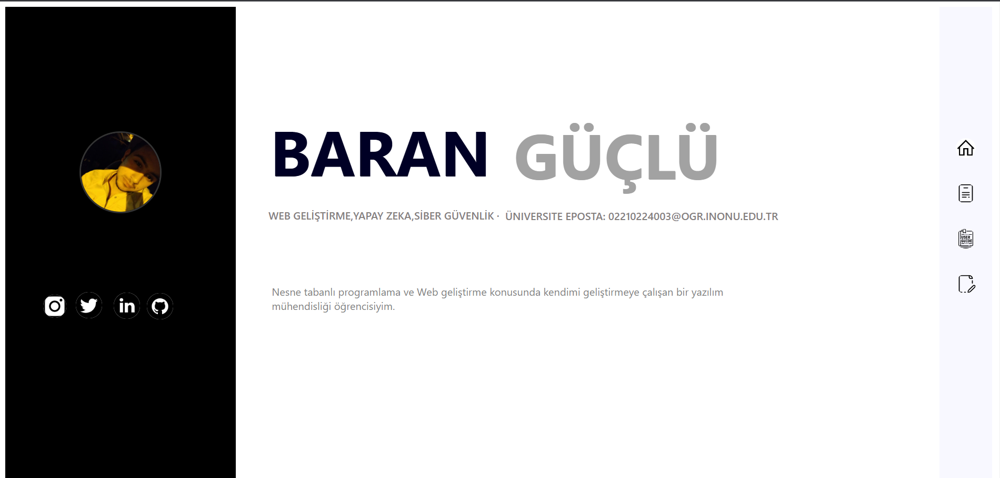
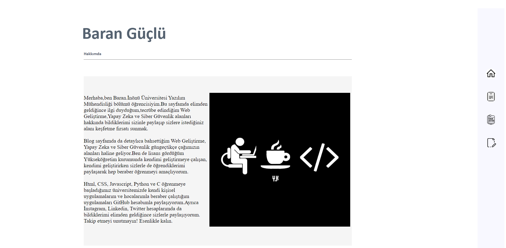
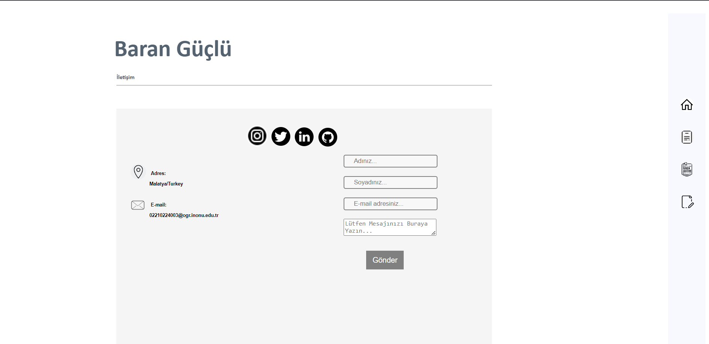
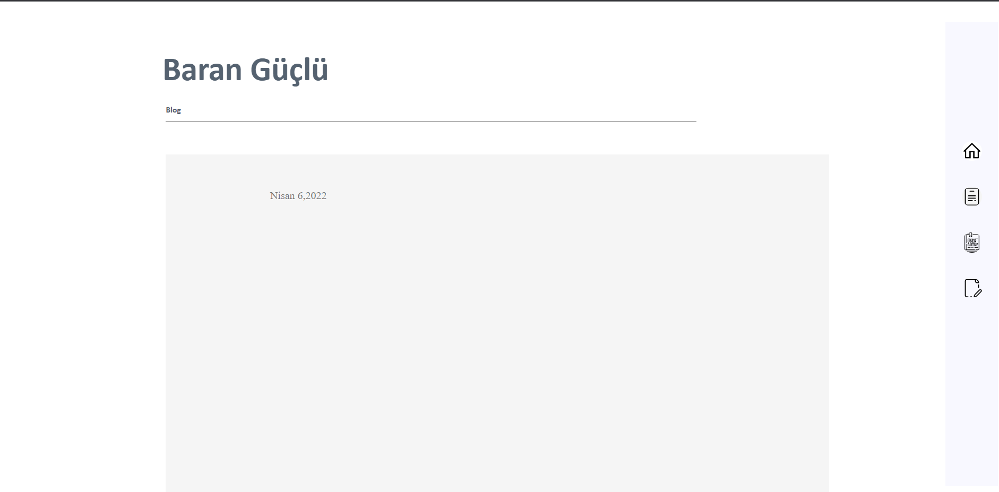

# 📝 Simple | Blog app 📝

It is my first website application personally.

It covers some very fundamental and neccessary features for the Web Application.It was basically designed using CSS.

### Tech use:

### Features:
- Homepage,About Me, Contact, Blog
- My social media accounts
- Article about myself
- Form to contact me
- My address

### Images:
> Home Page

> About Me

> Contact

> Blog

**Look forward to your reviews/suggestions.** 😀😇
